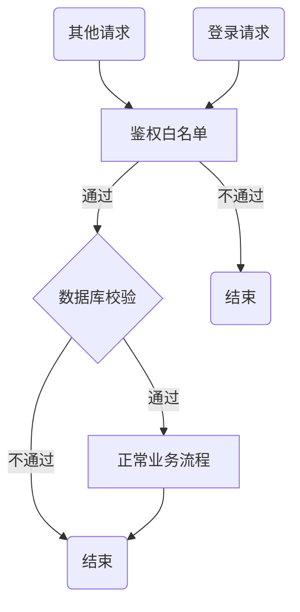

### sea sugar 在线聊天网站

------

建立一个基于express、mysql的在线聊天网站，要有用户信息，用户好友，聊天群聊，聊天信息，后端架构设计设计，表模型定义，数据库连接，http请求统一中间件处理。

------

###### 下载安装

```bash
## 克隆项目源码包
git clone https://github.com/gzydong/LumenIM.git

## 安装项目依赖扩展组件
npm install

# 初始化数据库
npm run init

# 启动本地开发环境
npm run dev


```


#### 一、mysql表结构设计

踩坑：主键是复合键的时候脑子抽了

1. 用户信息表（users）：

   - username（用户名）
   - user_id (用户id)
   - password（密码）
   - email（邮箱）
   - user_avatar（头像URL）
   - status（在线状态）
   - created_time（创建时间）

     

2. 用户好友表（user_friends）：

   - user_id（用户ID）
   - friend_id（好友ID）
   - created_time（创建时间）

     

3. 群聊表（chat_groups）：

   - group_id（群聊id）
   - group_name（群聊名称）
   - description（群聊描述）
   - owner_id（群主ID，外键关联users表）
   - created_time（创建时间）
   - group_avatar （群聊头像）

     

4. 群聊成员表（group_members）：

   - group_id（群聊ID，外键关联chat_groups表）
   - user_id（用户ID，外键关联users表）
   - joined_time（加入时间）
   - 

5. 聊天信息表（chat_messages）：

   - sender_id（发送者ID）
   - receiver_id（接收者ID，如果是群聊则为NULL）
   - group_id（群聊ID，如果是私聊则为NULL）
   - content（消息内容）
   - type（消息类型，如文本、图片、文件等）
   - send_time（发送时间）
   - message_id （消息id）

   

   

#### 二、测试数据库连接，初始化数据库

   

```js
const sequelize = require('./utils/database');

// 测试数据库连接
async function testConnection() {
  try {
    // 尝试连接数据库
    await sequelize.authenticate();
    console.log('Database connection has been established successfully.');
  } catch (error) {
    console.error('Unable to connect to the database:', error);
  } finally {
    // 关闭数据库连接
    await sequelize.close();
  }
}

// 调用测试连接函数
testConnection();
```

#### 三、http请求统一中间件处理

踩坑：**`res.status(200)`：** 这个状态码是HTTP响应的状态码，表示请求已成功。这个状态码意味着服务器已成功处理了请求，并且返回了所请求的资源。

**`res.data.code=200`：** 这个是我在响应数据中自己定义的一个字段，通常用来表示请求的处理状态。

如果是下面这种方法的话，status设置成401

```
res.error = (code = 401, msg) => {
    res.status(code).json({
      code,
      msg
    });
  };
```

axios会直接捕获这个401鉴权报错，导致无法给用户说明401的报错原因

```js
401 (Unauthorized)
request.js:91 errAxiosError: Request failed with status code 401
```

最后我改写成的响应中间件，纯粹是为了分明success和error，

```js
const responseMiddleware = (req, res, next) => {
  // 封装 res.success 方法
  res.success = (code = 200, msg = 'success', data) => {
    res.status(200).json({
      code,
      msg,
      data
    });
  };
  // 封装 res.error 方法
  res.error = (code = 400, msg) => {
    res.status(200).json({
      code,
      msg
    });
  };

  next();
};
module.exports = responseMiddleware;

// 调用 res.error(500 , '未知错误,请联系管理员重试。' );
```

#### 四、操作vuex

踩坑：不要直接在页面写登录逻辑，应该再store里面写，虽然我之前就是直接在页面写的 = . = 

在vuex里面写登录逻辑的**好**处：

1. **集中管理状态**: 将登录状态的管理放在 Vuex 的 `store` 中，可以确保在整个应用中都可以轻松地访问到登录状态。
2. **统一的状态更新**: 使用 Vuex 的 `commit` 方法提交 mutation，可以确保状态更新是同步的，并且是按照一定的规范进行的。
3. **可扩展性**: 通过 Vuex 的 `actions`，你可以很容易地扩展其他逻辑，例如处理异步操作、状态更新前的校验等。

```js
import { login, logout, getInfo } from '@/api/login'
import { getToken, setToken, removeToken } from '@/utils/auth'

const user = {
  state: {
    token: getToken(),
    name: '',
    avatar: '',
    roles: [],
    permissions: []
  },

  mutations: {
    SET_TOKEN: (state, token) => {
      state.token = token
    },
    SET_NAME: (state, name) => {
      state.name = name
    },
    SET_AVATAR: (state, avatar) => {
      state.avatar = avatar
    },
    SET_ROLES: (state, roles) => {
      state.roles = roles
    },
    SET_PERMISSIONS: (state, permissions) => {
      state.permissions = permissions
    }
  },

  actions: {
    // 登录
    Login({ commit }, userInfo) {
      const username = userInfo.username.trim()
      const password = userInfo.password
      const code = userInfo.code
      const uuid = userInfo.uuid
      return new Promise((resolve, reject) => {
        login(username, password, code, uuid).then(res => {
          setToken(res.token)
          commit('SET_TOKEN', res.token)
          resolve()
        }).catch(error => {
          reject(error)
        })
      })
    },
  }
}

export default user

```

在页面里面写登录逻辑的**坏**处：

1. **状态分散**: 登录状态被保存在组件的状态中，而不是统一管理在 Vuex 中，这样会导致状态的分散和管理复杂度的增加。
2. **耦合性增加**: 组件直接调用登录 API，会增加组件与业务逻辑之间的耦合度，不利于代码的维护和扩展。
3. **重复代码**: 如果其他组件也需要登录功能，就需要重复编写相同的登录逻辑，不利于代码复用和统一管理。

```js
<script>
import { login } from "@/apis/user";
export default {
    name: "login",
    data() {
      return {
      };
    },
    mounted() {

    },
    methods: {
      login(form) {
        this.$refs[form].validate((valid) => {
          if (valid) {
            this.paramsLogin.user_id = this.form.user_id ;
            this.paramsLogin.password = this.form.password ;
            login(this.paramsLogin).then(res =>{
                
                console.log(66666,res);
                if (res.code === 200 && res.msg === 'success') {
                  this.$message({
                    message: "登录成功啦",
                    type: "success",
                    showClose: true,
                  });
                  this.$router.replace("/index");
                } else {
                  this.$message({
                    message: "账户名或密码错误",
                    type: "error",
                    showClose: true,
                  });
                }
            }).catch(err =>{
                console.log(err);
                // this.$message({
                //   message: `${err}`,
                //   type: "error",
                //   showClose: true,
                // });
            })
          } else {
            return false;
          }
        });
      },
      
    },
  };
</script>
```


#### 五、登录的token验证以及无感刷新token

踩坑：前端按照规范写了，但是后台没有按照这个格式去解析，而且`Bearer`后面有一个空格

W3C 的 http1.0 规范，Authorization 的格式是：

```js
Authorization: <type> <authorization-parameters>
Authorization : Bearer Token  
// 注意空格
```

常见jwt头：

```js
Basic 用于 http-basic 认证；
Bearer 常见于 OAuth 和 JWT 授权；
Digest MD5 哈希的 http-basic 认证 (已弃用)
AWS4-HMAC-SHA256 AWS 授权
```

#### 六、登录鉴权流程



#### 七、添加前端404页面

```json
  {
    path: '/404',
    name: '404',
    meta: {
      title: 'Page not found',
    },
    component: () => import('@/views/404.vue')
  },
  // 所有未定义路由，全部重定向到404页
  {
    path: '*',
    redirect: '/404'
  }


```

#### 八、实时通信

使用socket.io来实现实时通信功能，包括用户间的私聊和群聊。连接URL时，如果要实现用户间的私聊，可以将用户ID动态地绑定到连接URL中，以便服务器知道要将消息发送给哪个用户。（没实现）

踩坑：创建 Express 应用的服务器时使用了 `app.listen()` 方法，然后创建了一个 `http` 服务器并传入了 Express 应用。通常情况下，应该只使用一个服务器来监听连接。直接使用 `server.listen()` 方法来启动你的 Express 应用，然后在同一个服务器上初始化 Socket.io。

踩坑：跨域问题，不懂看网上的解决办法搞的

目前的的解决办法就是发送一个自定义消息sendMessage给服务端，然后插入数据，广播这个数据，接收是对应就接收，否则抛弃这个数据。

```js
const socketIo = require('socket.io');
const { verifyToken }  = require('./jwt');
const chatMessage = require('../models/chatMessage')

module.exports = function initSocket(server) {
    const io = socketIo(server, {
        allowEIO3: true,
        cors: {
          origins: ['http://localhost:8080', 'http://localhost:8082', '*'],
          methods: ["GET", "POST"],
          credentials: true
        }
      });
      
    // 监听连接事件
    io.on('connection', socket => { 
        socket.on('message', function (data) {
            console.log(`${new Date().toLocaleString()} 接收到用户 ${decodedToken.username} message 消息 :`, data);
            // socket.send('你好客户端, ' + data);
        });
     
        socket.on('sendMessage', async function (data) {
            console.log(`${new Date().toLocaleString()} 接收到用户 ${decodedToken.username} sendmessage 消息 :`, data);
            let receiveData = null ;
            if (data.receiver_id !== undefined) {
                receiveData = await chatMessage.create({
                    sender_id: decodedToken.user_id,
                    receiver_id: data.receiver_id,
                    content: data.content,
                    type:data.type,
                });
            }else {
                receiveData = await chatMessage.create({
                    sender_id: decodedToken.user_id,
                    group_id: data.group_id,
                    content: data.content,
                    type:data.type,
                });
            }
            // 广播消息给所有客户端
            io.emit('receiveMessage', receiveData);
            console.log(`${new Date().toLocaleString()} 广播用户 ${decodedToken.username} receiveMessage 消息 :`, receiveData.dataValues);
        });

        // 监听断开连接事件
        socket.on('disconnect', () => {
            console.log(`${new Date().toLocaleString()} 用户 ${decodedToken.username} 已断开连接`);
        });
    });
    return io   
}
```

#### 九、输入框的回车与换行

踩坑：因为按下`shift`+`enter`的时候触发`handleShiftEnter`，`enter`也触发了`handleEnter`，所有要在`handleEnter`判断是否按下了shift，还有就光标的位置得正确。

```vue
<el-input
        type="textarea"
        resize="none"
        :autosize="{ minRows: 5, maxRows: 7}"
        v-model="textArea"
        @keydown.native.shift.enter="handleShiftEnter"
        @keydown.enter.native="handleEnter"
        >
</el-input>
```

```js
handleShiftEnter(event) {
        event.preventDefault(); // 阻止默认行为（不插入换行符）

        const textarea = event.target;
        const cursorPos = textarea.selectionStart;
        const textBeforeCursor = this.textArea.substring(0, cursorPos);
        const textAfterCursor = this.textArea.substring(cursorPos);

        // 更新文本并保持光标位置
        this.textArea = textBeforeCursor + '\n' + textAfterCursor;
        const newCursorPos = cursorPos + 1;
        this.$nextTick(() => {
          textarea.setSelectionRange(newCursorPos, newCursorPos);
        });
      },
handleEnter(event){
        if (event.key === 'Enter' && !event.shiftKey) {
          event.preventDefault(); // 阻止默认行为（不插入换行符）
          this.sendMessage();
        }
      },
```

#### 十、查询消息

踩坑：插入新的一行消息之后要：重新加载包含关联数据的实例

```js
await receiveData.reload();
```

我都以这样关联查询的方式来查询消息的发送、接收

```js
// 设置 ChatMessage 模型和 User 模型之间的关联关系
ChatMessage.belongsTo(User, { foreignKey: 'sender_id', as: 'sender' });
ChatMessage.belongsTo(User, { foreignKey: 'receiver_id', as: 'receiver' });
ChatMessage.belongsTo(ChatGroup, { foreignKey: 'group_id', as: 'group' });
```


查询

```js
messages = await ChatMessage.findAll({ // 私聊消息
where: {group_id: groupId},
	order: [['send_time', 'ASC']], // 按照发送时间升序排列
	attributes: ['sender_id', 'receiver_id', 'group_id', 'content','type','send_time'],
	include: [
		{ model: User, as: 'sender', attributes: ['user_id', 'username', 'user_avatar'] }, // 关联发送者信息
		{ model: ChatGroup, as: 'group', attributes: ['group_id', 'group_name', 'group_avatar', 'description'] } // 关联群聊信息
	]
});
```

```js
messages = await ChatMessage.findAll({ // 群聊消息
	where: {
		[Op.or]: [
		{
			sender_id: res.userinfo.user_id,
			receiver_id: receiverId,
		},
		{
			sender_id: receiverId,
			receiver_id: res.userinfo.user_id,
		},
	],},
	attributes: ['sender_id', 'receiver_id', 'group_id', 'content','type','send_time'],
	order: [['send_time', 'ASC']], // 按照发送时间升序排列
	include: [
		{ model: User, as: 'sender', attributes: ['user_id', 'username', 'user_avatar'] }, // 关联发送者信息
		{ model: User, as: 'receiver', attributes: ['user_id', 'username', 'user_avatar'] }, // 关联接收者信息
		]
});
```

